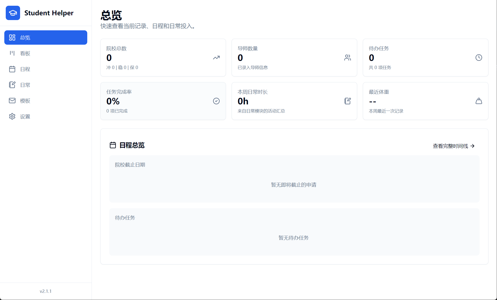
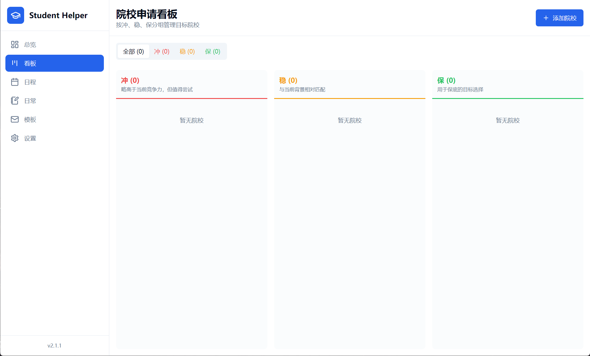
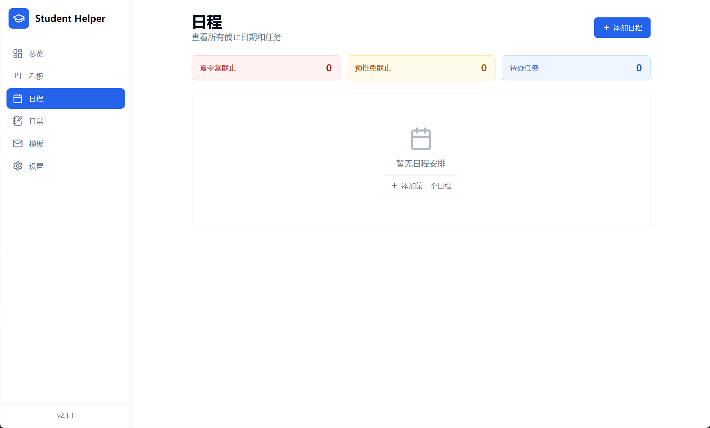
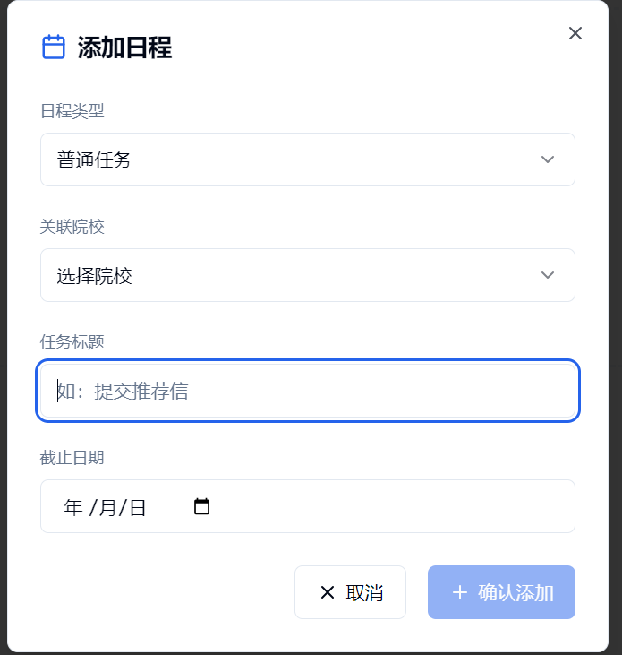
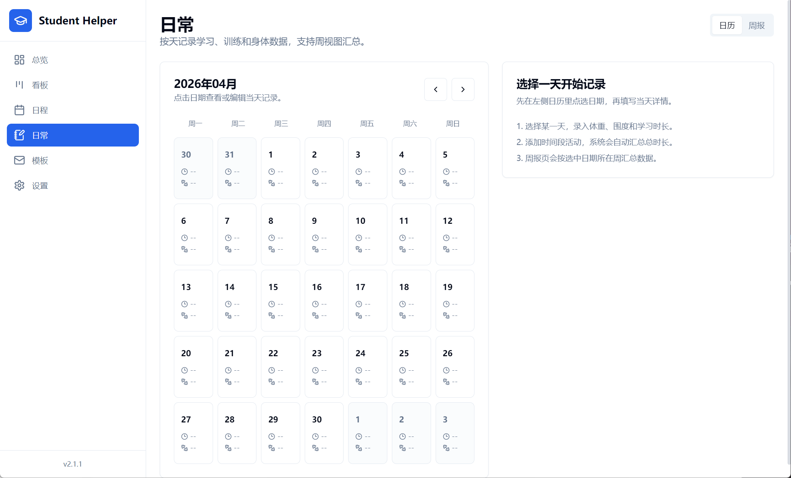
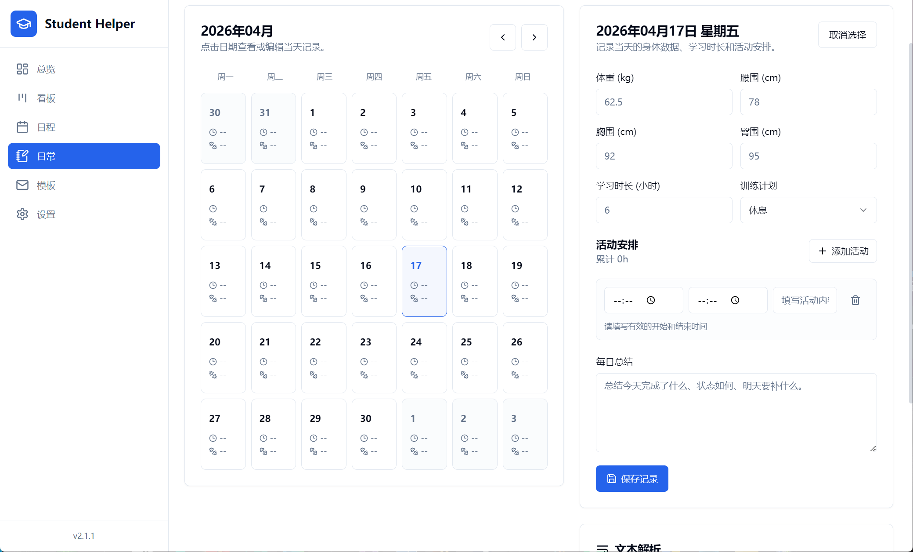
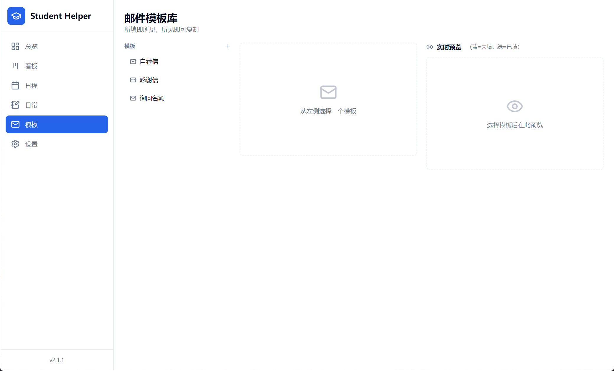
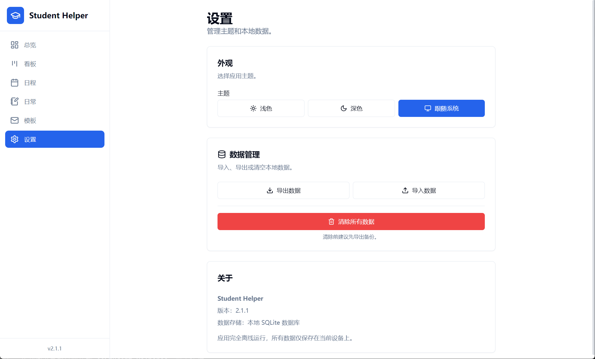
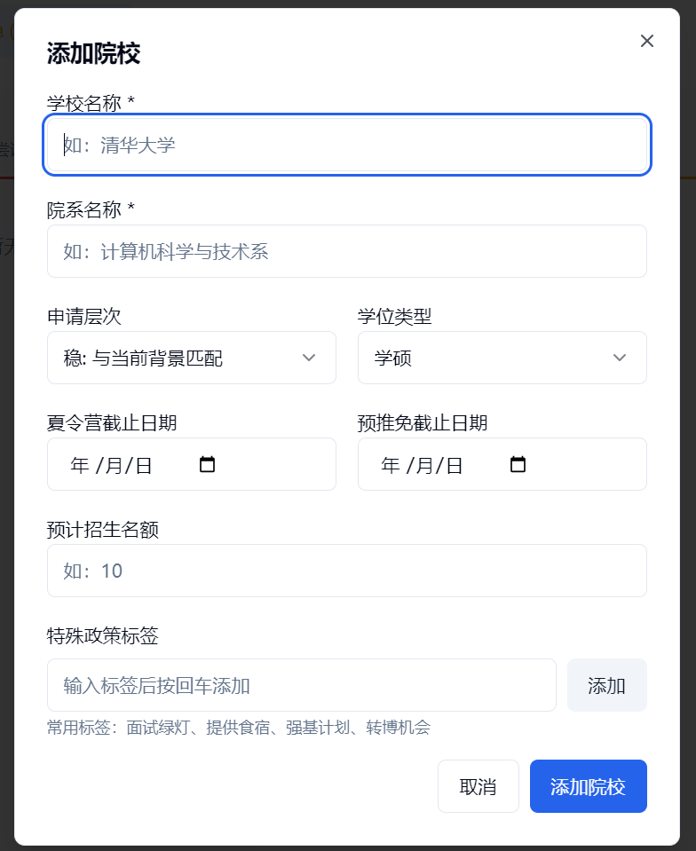
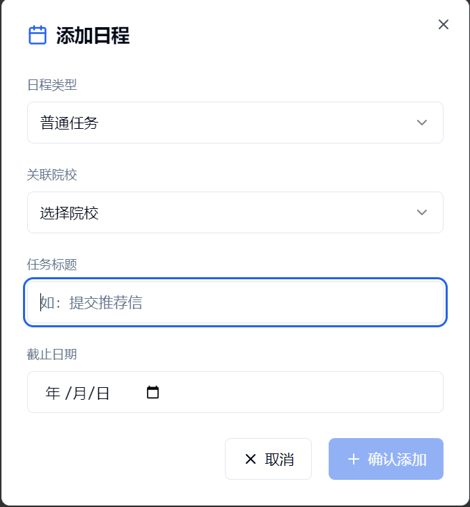

# Student Helper

保研信息收集、申请管理与日常记录工具。

Student Helper 是一款面向保研准备流程的 Windows 桌面应用，用于集中管理目标院校、导师联系、申请任务、日程提醒、邮件模板、面经记录和日常学习训练数据。应用基于本地 SQLite 数据库运行，默认离线保存数据，不联网、不上传。


仓库地址：[https://github.com/hnuQ/Student-Helper](https://github.com/hnuQ/Student-Helper)

---

## 软件截图

| 总览仪表板 | 院校看板 |
|:--:|:--:|
|  |  |

> **总览仪表板**：汇总院校数量、导师数量、待办任务、任务完成率、本周日常时长和最近体重，并按紧急程度提示临近截止日期。
>
> **院校看板**：按“冲 / 稳 / 保”分组展示目标院校，院校卡片包含院系、截止日期、导师数量和申请层次。

---

| 日程视图 | 添加日程 |
|:--:|:--:|
|  |  |

> **日程视图**：统一展示夏令营截止、预推免截止和普通任务，并按已过期、今天、明天、本周、即将到来分组。
>
> **添加日程**：支持创建普通任务，也支持为院校补充夏令营或预推免截止日期；普通任务可选择是否关联院校。

---

| 日常记录 | 日常详细写入 |
|:--:|:--:|
|  |  |

> **日常记录**：通过日历查看每天的学习、训练和身体数据记录，周报页会汇总本周投入。
>
> **日常详细写入**：记录体重、围度、学习时长、训练计划、活动时间段和每日总结，也可以把日记式文本解析为结构化记录。

---

| 邮件模板 | 设置 |
|:--:|:--:|
|  |  |

> **邮件模板**：维护自荐信、询问信、感谢信等模板，支持变量占位符、实时预览、变量填充和一键复制最终邮件。
>
> **设置**：支持浅色、深色、跟随系统主题，也支持 JSON 数据导出、导入恢复和本地数据清空。

---

| 添加院校 | 添加任务 |
|:--:|:--:|
|  |  |

> **添加院校**：录入学校名称、院系、申请层次、学位类型、截止日期、招生名额和特殊政策标签。
>
> **添加任务**：为院校创建待办事项，并按截止日期进入日程统一管理。

---

## 下载与安装

当前 Release 提供 Windows 免安装压缩包。

1. 打开 [Releases](https://github.com/hnuQ/Student-Helper/releases) 页面。
2. 在最新版本的 Assets 中下载 `Student-Helper-2.1.1-windows-unpacked.zip`。
3. 解压 zip 文件，进入解压后的 `win-unpacked` 目录。
4. 双击 `Student Helper.exe` 运行。
5. 首次启动会自动初始化本地 SQLite 数据库，无需额外配置。

注意事项：

- 不要只单独复制 `Student Helper.exe`，它需要和同目录 DLL 以及 `resources/` 一起运行。
- 如果 Windows 提示“SmartScreen 筛选器已阻止启动”，点击“更多信息”后选择“仍要运行”。这是未签名桌面应用的常见提示。
- 数据默认保存在 `%APPDATA%\Student Helper\dev.db`。

---

## 快速开始

1. **添加院校**：在看板页点击“添加院校”，录入院校、院系、申请层次、学位类型和截止日期。
2. **维护导师**：进入院校详情后添加导师联系方式、研究方向、主页、联系状态和备注。
3. **追踪进度**：更新导师联系状态，记录从未联系、已发送、已回复、面试中到已接受或已拒绝的过程。
4. **管理任务**：为院校创建任务，或在日程页创建独立任务，并按截止日期跟踪完成情况。
5. **记录面经**：面试后记录面试形式、日期和 Markdown 面经内容。
6. **生成邮件**：在“模板”页面选择或新建邮件模板，填入变量后一键复制最终邮件内容。
7. **记录日常**：在“日常”页面按天记录学习时长、训练计划、身体数据和活动安排，并生成周报汇总。
8. **备份数据**：在“设置”页面导出 JSON 备份，换设备时可导入恢复。

---

## 核心功能

### 1. 总览仪表板

- 按“冲 / 稳 / 保”统计院校数量。
- 展示导师数量、待办任务数量、任务完成率。
- 展示本周日常模块累计时长和最近一次体重记录。
- 汇总院校截止日期和待办任务，帮助优先处理临近节点。

### 2. 院校看板

- 三列看板：冲、稳、保。
- 院校卡片展示院校名称、院系、学位类型、招生名额、特殊政策标签、截止日期倒计时和导师数量。
- 支持按等级筛选，点击卡片进入院校详情。

### 3. 院校与导师管理

- 院校详情集中展示基础信息、导师列表和关联任务。
- 导师信息支持姓名、职称、研究方向、邮箱、主页、联系状态、声誉评分、备注和关联文件。
- 同一院系多位导师同时处于“已发送”状态时会进行冲突提醒。
- 支持记录面试日期、面试形式和结构化 Markdown 面经。

### 4. 任务与日程

- 任务可关联院校，也可作为独立任务存在。
- 日程页将院校截止日期和普通任务合并展示。
- 独立任务支持直接完成、编辑和删除。
- 已完成任务会以删除线和弱化效果显示。

### 5. 邮件模板

- 内置自荐信、询问信、感谢信模板。
- 支持新增、编辑、删除自定义模板。
- 支持变量占位符，例如 `{{ADVISOR_NAME}}`、`{{YOUR_NAME}}`、`{{RESEARCH_INTEREST}}`。
- 编辑区可插入变量标签，预览区会显示填充后的最终内容。
- 变量填充值会保存在本地浏览器存储中，方便下次继续使用。

### 6. 日常记录

- 按日历选择日期，记录学习时长、训练计划、体重、腰围、胸围、臀围和每日总结。
- 支持添加多个活动时间段，自动计算累计活动时长。
- 支持把日记式文本解析为日期、身体数据和活动时间段，再一键应用到表单。
- 周报页展示本周总时长、体重变化、已记录天数、累计活动，并支持保存周总结。
- 总览仪表板会同步展示本周日常时长和最近体重。

### 7. 文件与数据

- 支持为导师绑定简历、成绩单、推荐信等本地文件路径。
- 支持通过系统默认程序打开关联文件。
- 支持本地 LaTeX 编译能力，依赖本机 `xelatex`。
- 支持 JSON 数据导出、导入和清空本地数据。

---

## 数据模型

```text
Institution（院校）
├── advisors[]    导师列表
└── tasks[]       院校关联任务

Advisor（导师）
├── contactStatus 联系状态
├── assets[]      关联文件
└── interviews[]  面经记录

Task（任务）
├── institutionId 可为空；为空时表示独立任务
└── dueDate       截止日期

EmailTemplate（邮件模板）
└── variables[]   模板变量

DailyRecord（日常记录）
├── weight / waist / chest / hips
├── studyMinutes / totalMinutes
├── trainingPlan / summary / rawText
└── activities[]  活动时间段

WeeklySummary（周总结）
└── summary       每周回顾
```

所有数据存储在本地 SQLite 数据库中，不联网、不上传。

---

## 技术栈

| 类别 | 技术 |
|------|------|
| 桌面框架 | Electron 33 |
| 前端 | React 18 + TypeScript |
| 构建工具 | electron-vite + Vite 5 |
| 打包 | electron-builder |
| UI 组件 | Radix UI + Tailwind CSS |
| 数据库 | SQLite + Prisma ORM 5.x |
| 状态管理 | Zustand |
| 日期处理 | date-fns |

---

## 项目结构

```text
Student Helper/
├── electron/
│   ├── main/index.ts          # 主进程：数据库、文件、IPC、日常解析
│   └── preload/index.ts       # 安全 IPC 桥接
├── prisma/
│   ├── schema.prisma          # 数据库模型定义
│   └── dev.db                 # SQLite 数据库文件
├── src/
│   ├── App.tsx                # 应用入口与视图路由
│   ├── components/
│   │   ├── features/
│   │   │   ├── Dashboard.tsx
│   │   │   ├── KanbanBoard.tsx
│   │   │   ├── InstitutionDetail.tsx
│   │   │   ├── Timeline.tsx
│   │   │   ├── DailyTracker.tsx
│   │   │   ├── EmailTemplates.tsx
│   │   │   └── Settings.tsx
│   │   ├── layout/
│   │   └── ui/
│   ├── stores/appStore.ts
│   └── lib/utils.ts
├── docs/images/               # README 截图
├── electron-builder.yml       # Windows 打包配置
├── electron-builder-mac.yml   # macOS 打包配置
├── electron-builder-linux.yml # Linux 打包配置
└── package.json
```

---

## 本地开发

```bash
npm install
npm run dev
```

---

## 构建 Windows 发行版

```bash
npm run build:win
```

构建产物会输出到 `release/` 目录，当前 Release 使用的是完整的免安装目录：

```text
release/win-unpacked/
```

发布时将该目录整体打包为：

```text
Student-Helper-2.1.1-windows-unpacked.zip
```

---

## License

MIT
